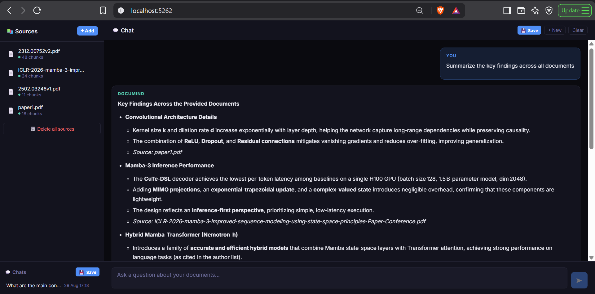
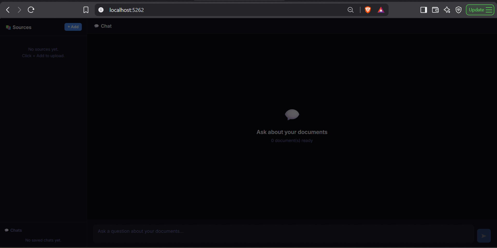
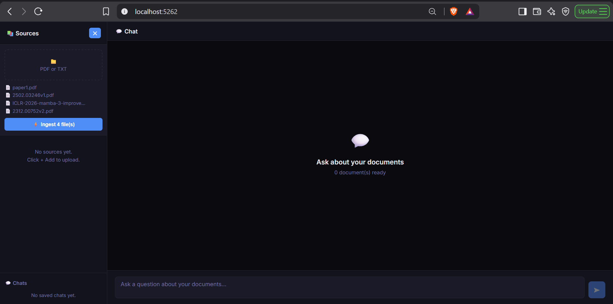
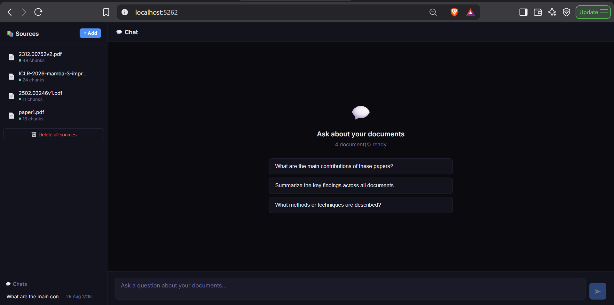
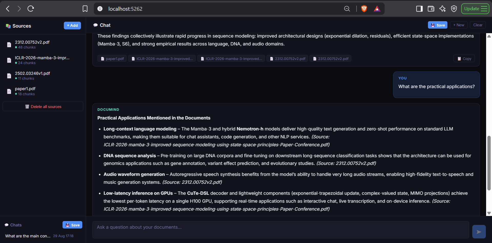
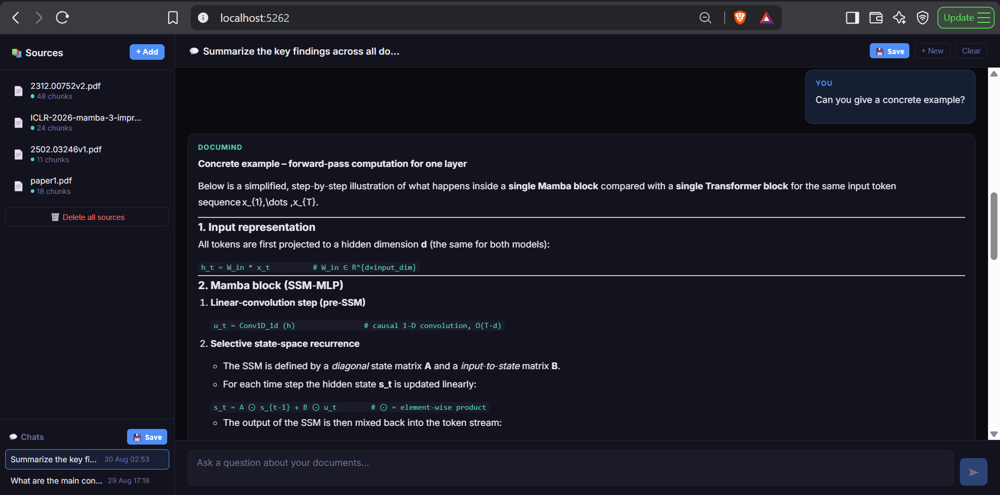
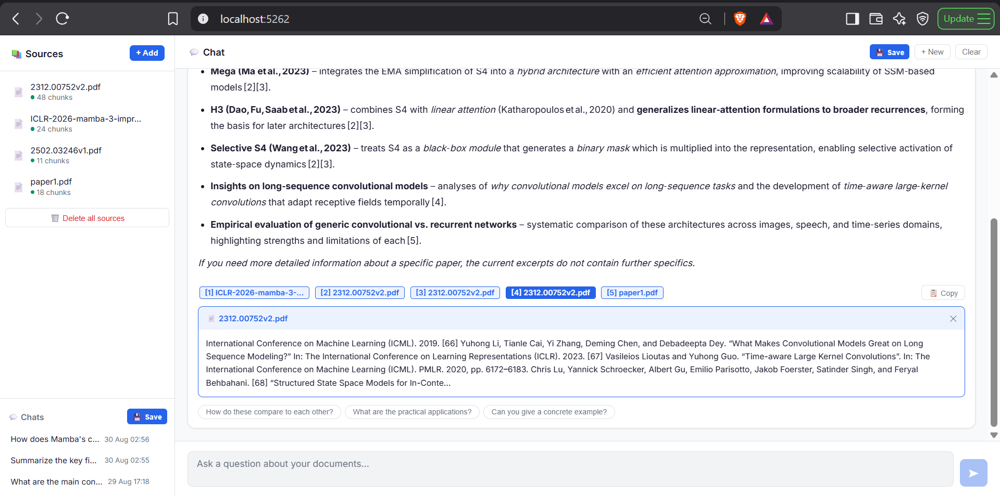
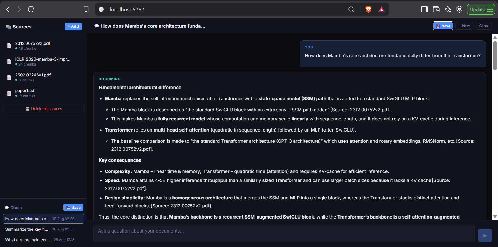

# DocuMind — AI Document Intelligence Platform

> A NotebookLM-inspired RAG platform built with C#/.NET 10. Upload research papers or documents, chat with them using AI, and get answers with inline citations showing exactly where each fact comes from.



---

## Features

- **NotebookLM-style two-panel layout** — sources on the left, chat on the right
- **Multi-document upload** — upload multiple PDFs or TXT files simultaneously
- **Hybrid search retrieval** — vector similarity (pgvector) and PostgreSQL full-text search merged via Reciprocal Rank Fusion
- **Cross-encoder reranking** — top 25 hybrid candidates reranked by Cohere `rerank-v3.5` down to the most relevant 5
- **AI chat with citations** — answers include inline `[1]` `[2]` numbers linked to source chunks
- **Citation popup** — click any `[1]` citation to see the exact text from the source document
- **Conversation history** — save, load and continue past chats
- **Follow-up suggestions** — contextual question suggestions after each answer
- **Export to markdown** — download any conversation as a `.md` file
- **Time-based themes** — UI automatically adapts to morning / afternoon / evening / night
- **Fast inference** — Groq API for sub-5-second responses
- **Graceful degradation** — runs without a Cohere key (skips reranking) or without a Groq key (falls back to local Ollama chat)

---

## Screenshots

| Empty State | Upload Documents |
|-------------|-----------------|
|  |  |

| Sources Loaded | AI Answer with Citations |
|----------------|--------------------------|
|  |  |

| Multi-document Answer | Code Answer |
|----------------------|-------------|
|  |  |

| Citation Popup | Saved Chats |
|----------------|-------------|
|  |  |

---

## Architecture

```
PDF Upload
  └── PdfPig parser
        └── Sliding-window chunker
              └── nomic-embed-text (Ollama, local)
                    └── pgvector + PostgreSQL full-text (PostgreSQL)
                          └── Hybrid search (RRF of vector + text, top 25)
                                └── Cohere rerank-v3.5 (top 25 → top 5)
                                      └── Groq LLM (openai/gpt-oss-120b)
                                            └── Blazor Server UI
```

---

## Tech Stack

| Layer | Technology |
|-------|-----------|
| Frontend | Blazor Server (.NET 10) |
| Backend | ASP.NET Core Minimal API (.NET 10) |
| AI / LLM | Groq API (`openai/gpt-oss-120b`), via Microsoft Semantic Kernel |
| Embeddings | Ollama (`nomic-embed-text`, runs locally) |
| Retrieval | Hybrid search — pgvector cosine similarity + PostgreSQL full-text, merged with Reciprocal Rank Fusion |
| Reranking | Cohere `rerank-v3.5` (optional — falls back to a no-op reranker if no API key is set) |
| Vector Store | PostgreSQL + pgvector |
| PDF Parsing | PdfPig |
| ORM | Entity Framework Core 9 |
| Markdown | Markdig |

---

## Project Structure

```
DocuMind/
├── src/
│   ├── DocuMind.Api/             # ASP.NET Core Minimal API
│   ├── DocuMind.Web/             # Blazor Server UI
│   ├── DocuMind.Core/            # Business logic & services
│   ├── DocuMind.Domain/          # Entities & interfaces
│   └── DocuMind.Infrastructure/  # Repositories & EF Core DbContext
├── tests/
│   └── DocuMind.Tests/           # Unit tests
├── infra/
│   └── docker-compose.yml        # PostgreSQL + pgvector
└── docs/
    └── screenshots/
```

---

## Getting Started

### Prerequisites

- [.NET 10 SDK](https://dotnet.microsoft.com/download)
- [Docker Desktop](https://www.docker.com/products/docker-desktop)
- [Ollama](https://ollama.com/download) — for local embeddings
- [Groq API key](https://console.groq.com) — free tier, no credit card required

---

### 1. Clone the repository

```bash
git clone https://github.com/nishanthrjn/DocuMind_UI.git
cd DocuMind_UI
```

---

### 2. Start PostgreSQL with pgvector

```bash
docker-compose -f infra/compose.yml up -d
```

---

### 3. Pull the embedding model

```bash
ollama pull nomic-embed-text
```

---

### 4. Configure API keys

Create `src/DocuMind.Api/appsettings.json` (this file is git-ignored):

```json
{
  "ConnectionStrings": {
    "DefaultConnection": "Host=localhost;Port=5432;Database=documind;Username=documind;Password=documind_dev"
  },
  "Ollama": {
    "Endpoint": "http://localhost:11434",
    "EmbeddingModel": "nomic-embed-text"
  },
  "Groq": {
    "ApiKey": "your-groq-api-key-here",
    "ChatModel": "openai/gpt-oss-120b"
  },
  "Cohere": {
    "ApiKey": "your-cohere-api-key-here",
    "Model": "rerank-v3.5"
  },
  "Logging": {
    "LogLevel": {
      "Default": "Information",
      "Microsoft.AspNetCore": "Warning",
      "Microsoft.EntityFrameworkCore": "Warning"
    }
  },
  "AllowedHosts": "*"
}
```

Get your free Groq API key at [console.groq.com](https://console.groq.com). `Cohere:ApiKey` is optional — get one at [dashboard.cohere.com](https://dashboard.cohere.com); if omitted, reranking is skipped and the top hybrid-search results are used as-is.

---

### 5. Run the application

**Terminal 1 — API (port 5082):**
```bash
dotnet run --project src/DocuMind.Api
```

**Terminal 2 — Web UI (port 5262):**
```bash
dotnet run --project src/DocuMind.Web
```

Open [http://localhost:5262](http://localhost:5262) in your browser.

---

## How It Works

### Ingestion pipeline
1. Upload a PDF or TXT file via the UI
2. **PdfPig** extracts raw text from the PDF
3. Text is split into overlapping chunks (sliding window)
4. Each chunk is embedded using **nomic-embed-text** running locally via Ollama
5. Embeddings are stored in **PostgreSQL** with the pgvector extension

### Query pipeline
1. Your question is embedded using the same model
2. **Hybrid search** retrieves the top 25 candidates by merging pgvector cosine similarity and PostgreSQL full-text search (`websearch_to_tsquery`) with Reciprocal Rank Fusion
3. **Cohere rerank-v3.5** reranks those 25 candidates down to the top 5 most relevant chunks (skipped if no Cohere key is configured)
4. Chunks are sent to **Groq** as numbered context `[1]`, `[2]`, etc.
5. Groq generates a cited answer referencing the source numbers
6. Click any `[1]` citation to see the exact source text

---

## API Endpoints

| Method | Endpoint | Description |
|--------|----------|-------------|
| `GET` | `/health` | Health check |
| `GET` | `/api/documents` | List all documents |
| `GET` | `/api/documents/{id}` | Get a single document |
| `POST` | `/api/documents/ingest` | Upload and ingest a document |
| `DELETE` | `/api/documents/{id}` | Delete a document |
| `DELETE` | `/api/documents` | Delete all documents |
| `POST` | `/api/query` | Query documents with AI |
| `GET` | `/api/conversations` | List saved conversations |
| `GET` | `/api/conversations/{id}` | Load a conversation |
| `POST` | `/api/conversations` | Save a conversation |
| `DELETE` | `/api/conversations/{id}` | Delete a conversation |

Interactive API docs available at [http://localhost:5082/scalar/v1](http://localhost:5082/scalar/v1)

---

## Running Tests

```bash
dotnet test
```

---

## Configuration Reference

| Setting | Description | Default |
|---------|-------------|---------|
| `Groq:ApiKey` | Groq API key | Falls back to local Ollama chat (`llama3.2`) if unset |
| `Groq:ChatModel` | Groq model ID | `openai/gpt-oss-120b` |
| `Cohere:ApiKey` | Cohere API key, used for reranking | Optional — reranking is skipped if unset |
| `Cohere:Model` | Cohere rerank model ID | `rerank-v3.5` |
| `Ollama:Endpoint` | Ollama server URL | `http://localhost:11434` |
| `Ollama:EmbeddingModel` | Embedding model | `nomic-embed-text` |
| `ConnectionStrings:DefaultConnection` | PostgreSQL connection string | Required |

---

## License

MIT — feel free to use this as a starting point for your own RAG applications.

---

## Author

**Nishanth Rajan** — Software Engineer, Hannover Germany (EU Blue Card holder) — [LinkedIn](https://linkedin.com/in/nishanthrajan) · [GitHub](https://github.com/nishanthrjn/DocuMind_UI)

